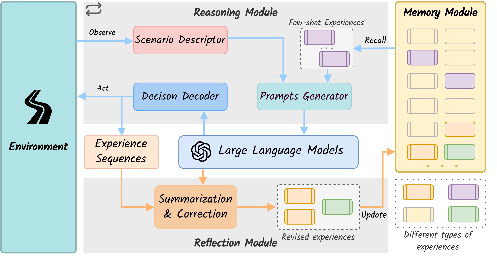

# DiLu🐴: A Knowledge-Driven Approach to Autonomous Driving with Large Language Models

[](https://arxiv.org/abs/2309.16292)
[](https://pjlab-adg.github.io/DiLu)
[](https://github.com/pjlab-adg/DiLu/stargazers)
[](https://github.com/PJLab-ADG/DiLu/issues)
[](https://github.com/PJLab-ADG/DiLu/pulls)


> 堕檀溪水中，溺不得出。备急曰：‘**的卢**，今日厄矣，可努力！’**的卢**乃一踊三丈，遂得过，乘浮渡河. -- 三国志
> 
> In the face of adversity, the legendary horse DiLu  follows Liu Bei's words to leapt across the Tanxi River, embodying intelligence and strength. Inspired by this tale, our DiLu framework endeavors to navigate the challenging terrains of autonomous driving.


https://github.com/PJLab-ADG/DiLu/assets/18390668/cd48747f-f710-4a42-abb9-ca15e7ee68f2


## 🔍 Framework Overview



DiLu is an innovative **closed-loop**, **self-evolving** framework, blending common-sense knowledge and memory components with the power of large language models. DiLu consists of four core modules: Environment, Reasoning, Reflection, and Memory.

DiLu is not just a framework, it's an exploration of [Knowledge-driven Autonomous Driving](https://github.com/PJLab-ADG/awesome-knowledge-driven-AD).


## 🌟 Highlights
- **`2024-01-22`** Codes are now release!
- **`2024-01-17`** Exciting news! **DiLu is accepted by ICLR 2024 🎉🎉!** 
- **`2023-10-12`** Explore our project page, now live [here](https://pjlab-adg.github.io/DiLu)🔗!
- **`2023-09-28`** Our paper is available on [Arxiv](https://arxiv.org/abs/2309.16292)📄!


## 🚀 Getting Started
### 1. Requirements 📦

For an optimal experience, we recommend using conda to set up a new environment for DiLu.

```bash
conda create -n dilu python=3.8 
conda activate dilu
pip install -r requirements.txt
```

📝 **Note:** DiLu requires specific versions of certain libraries **(i.e. `langchain==0.0.335`, `openai==0.28.1`, `chromadb==0.3.29`)**, Please adhere to the versions specified in  `requirements.txt`.

### 2. Configuration ⚙️ 

All configurable parameters are located in `config.yaml`.

Before running DiLu, set up your OpenAI API keys. DiLu supports both OpenAI and Azure Openai APIs. 

Configure as below in `config.yaml`:
```yaml
OPENAI_API_TYPE: # 'openai' or 'azure'
# below are for Openai
OPENAI_KEY: # 'sk-xxxxxx' 
OPENAI_CHAT_MODEL: 'gpt-4-1106-preview' # Alternative models: 'gpt-3.5-turbo-16k-0613' (note: performance may vary)
# below are for Azure OAI service
AZURE_API_BASE: # https://xxxxxxx.openai.azure.com/
AZURE_API_VERSION: "2023-07-01-preview"
AZURE_API_KEY: #'xxxxxxx'
AZURE_CHAT_DEPLOY_NAME: # chat model deployment name
AZURE_EMBED_DEPLOY_NAME: # text embed model deployment name  
```


### 3. Running DiLu 🐴

Running DiLu is straightforward:
```bash
python run_dilu.py
```
The default setting runs a 3-shot simulation with different seeds. You can modify this in `config.yaml`.

After completing the simulations, check the `results` folder. `log.txt` contains detailed steps and seeds for each simulation, and all simulation videos are saved here too.

📝 **Note:** During DiLu execution, the 'highway-env' pygame window might appear unresponsive. If the terminal is actively outputting, everything is running as expected.


#### Use reflection module:

To activate the reflection module, set `reflection_module` to True in `config.yaml`. New memory items will be saved to the updated memory module.

## 4. Visualizing Results 📊

We provide a visualization scripts for the simulation result.
```bash
python ./visualize_results.py -r results/highway_0.db -m memories/20_mem
```
Open `http://127.0.0.1:7860` to view each frame's prompts and decisions!


## 🔖 Citation
If you find our paper and codes useful, please kindly cite us via:

```bibtex
@article{wen2023dilu,
  title={Dilu: A knowledge-driven approach to autonomous driving with large language models},
  author={Wen, Licheng and Fu, Daocheng and Li, Xin and Cai, Xinyu and Ma, Tao and Cai, Pinlong and Dou, Min and Shi, Botian and He, Liang and Qiao, Yu},
  journal={arXiv preprint arXiv:2309.16292},
  year={2023}
}
```

## 📝 License
DiLu is released under the Apache 2.0 license.
